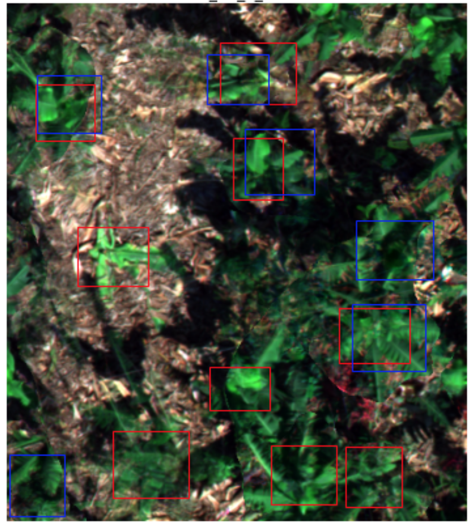
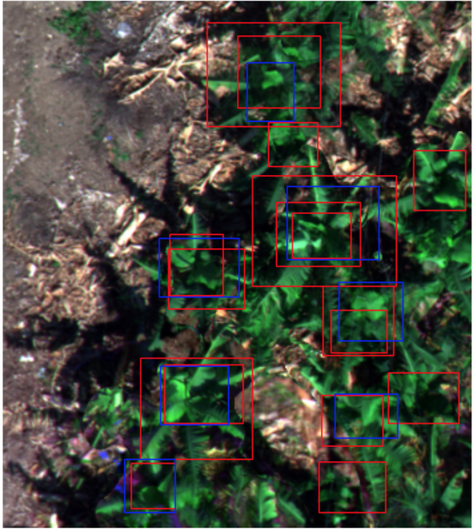
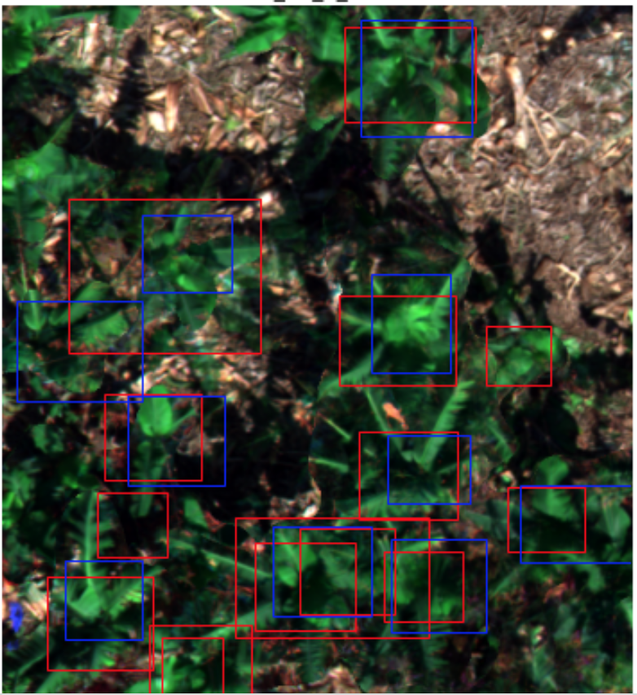

### 1. Detection Banana trees from images taken by an unmanned aerial vehicle.
### 2. classifying the Banana trees as dauhghters(can grow fruits) / mothers (can't grow fruits) according to spectral images.

