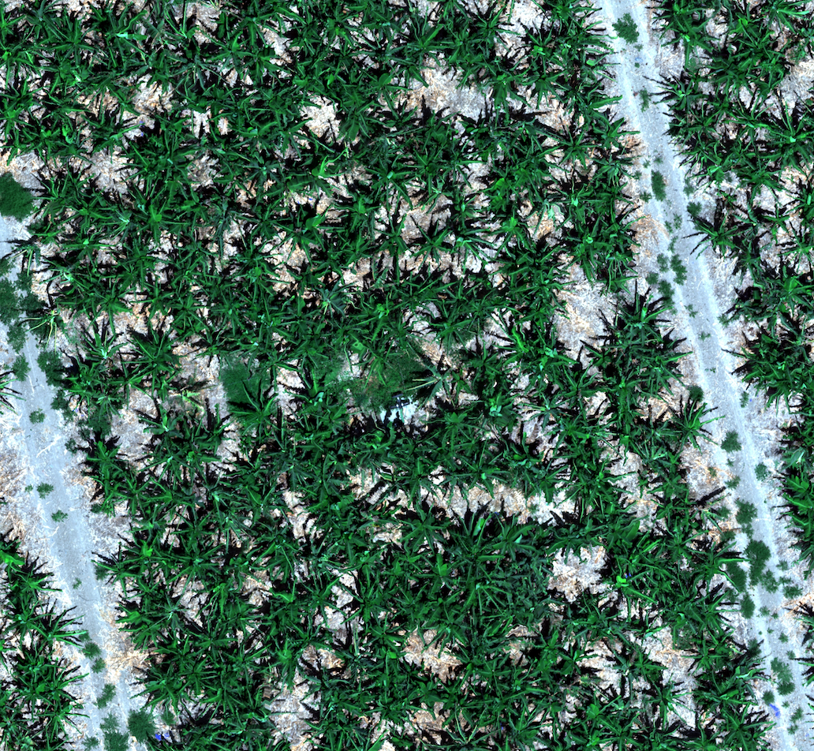

### 1. Detection Banana trees from images taken by an unmanned aerial vehicle.
### 2. classifying the Banana trees as dauhghters(can grow fruits) / mothers (can't grow fruits) according to spectral images.

*sample input image:* 

*prediction:*

red bboxes - prediction

blue bboxes - ground truth

i have reached mAP=0.7

i have received tagged dataset which have points instead of bbox as ground truth.
i'm planning  to use the technic in following paper: 

**full paper PDF: [Locating Objects Without Bounding Boxes] (https://arxiv.org/pdf/1806.07564v2.pdf)
